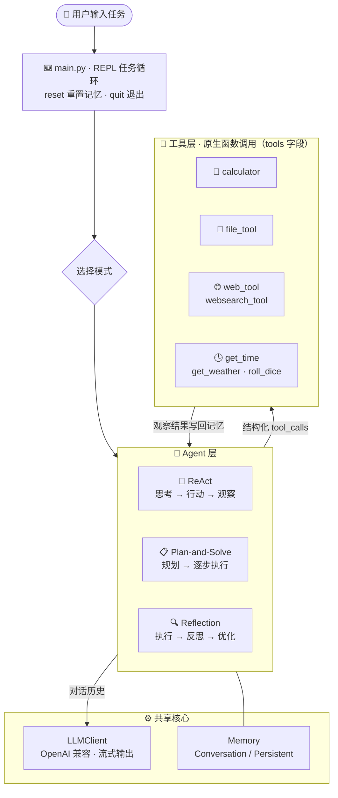

<div align="center">

# 🤖 MartinAgent

**从零手写的命令行 AI Agent —— 用纯 Python 把 ReAct / Plan-and-Solve / Reflection 讲明白**

*Without heavy frameworks. Just you, Python, and the LLM.*

[](https://www.python.org/)
[](https://platform.openai.com/docs/api-reference)
[](./VERSION)
[](#-注意)
[](#-贡献)

[快速开始](#-快速开始) · [Agent 模式](#-三种-agent-模式) · [内置工具](#-内置工具) · [项目结构](#-项目结构) · [学习路线](#-学习路线)

</div>

> [!IMPORTANT]
> **学习声明**：本项目仅用于学习与研究目的。请勿使用 AI 对本项目进行修改或自动改动。

MartinAgent 是一个跑在终端里的迷你 Agent 框架：不依赖 LangChain 等重型框架，
一行一行实现 **工具调用、多轮规划、自我反思** 的完整闭环。
支持任意 **OpenAI 兼容 API**（OpenAI / DeepSeek / 智谱 GLM 等），
工具调用与结构化输出统一走 **原生函数调用**（`tools` 字段），没有脆弱的正则解析层。

---

## ✨ 核心特性

- 🔁 **三种经典 Agent 范式** —— ReAct、Plan-and-Solve、Reflection 一键切换，对照着学差别
- 🛠️ **原生函数调用** —— 工具调用与结构化输出都走 API 的 `tools` 字段，模型填参数表而不是自由写 JSON，从源头避免解析错误
- 🌊 **流式输出** —— 思考过程逐字打印到终端，看得见 Agent 怎么想
- 🧰 **开箱即用的 7 个工具** —— 计算、文件沙箱、网页抓取、网页搜索、时间、天气、掷骰子
- 🧠 **双记忆实现** —— 进程内 `ConversationMemory` 或落盘 `PersistentMemory`（`logs/memory.json`），重启自动加载
- 🔌 **OpenAI 兼容** —— 改两个环境变量即可接入 DeepSeek / 智谱 / OpenAI 任一服务商
- ➕ **加工具只要 3 步** —— 写一个模块、导出 4 个约定字段、注册进字典

## 🧭 架构总览



## 🎭 三种 Agent 模式

| | 范式 | 一句话流程 | 适用场景 |
|:---:|---|---|---|
| `1` | 🔄 **ReAct** | Thought → Action → Observation，边想边做循环迭代 | 需要多轮调用工具的即时问答类任务 |
| `2` | 📋 **Plan-and-Solve** | Planner 先拆解为有序步骤 → Executor 按步执行 | 步骤清晰、可预先规划的多步任务 |
| `3` | 🔍 **Reflection** | 先产出初稿 → 自我评审（submit_review）→ 按反馈迭代优化 | 代码等需要质量打磨的生成类任务 |

> 💡 Planner 提交计划走 `submit_plan`、Reflection 提交评审走 `submit_review` —— 都是用函数调用承载的结构化输出，让模型「填参数」而不是「编 JSON」。

## 🚀 快速开始

在仓库**根目录**操作：

### 1️⃣ 创建虚拟环境并安装依赖

```bash
cd MartinAgent

# 创建虚拟环境（强烈推荐，避免污染全局依赖）
python3 -m venv .venv
source .venv/bin/activate       # Linux / macOS
# .venv\Scripts\activate        # Windows

# 安装核心依赖
pip install -r requirements.txt

# 验证安装
python -c "import openai; print('OpenAI SDK 安装成功')"
```

### 2️⃣ 配置 API Key

```bash
cp my-agent/.env.example my-agent/.env
```

编辑 `my-agent/.env`，最小配置示例（DeepSeek）：

```dotenv
OPENAI_API_KEY=your-api-key-here
OPENAI_BASE_URL=https://api.deepseek.com/v1
MODEL_NAME=deepseek-chat
```

常用 Base URL 参考：

| 服务商 | Base URL |
|---|---|
| DeepSeek | `https://api.deepseek.com/v1` |
| OpenAI | `https://api.openai.com/v1` |
| 智谱 GLM | `https://open.bigmodel.cn/api/paas/v4` |

<details>
<summary>🔧 虚拟环境损坏了怎么办？</summary>

```bash
deactivate                                # 先退出虚拟环境
rm -rf ~/project/MartinAgent/.venv        # 删除损坏的目录
python3 -m venv .venv                     # 重新创建，重复第 1 步
```

</details>

### 3️⃣ 启动

```bash
cd my-agent
python main.py
```

启动后先选模式（`1` ReAct / `2` Plan-and-Solve / `3` Reflection），然后按轮输出思考过程（流式），最多 8 轮工具迭代。

## ⚙️ 环境变量

| 变量 | 必填 | 说明 |
|---|:---:|---|
| `OPENAI_API_KEY` | ✅ | API 密钥 |
| `OPENAI_BASE_URL` | ✅ | 接口地址（任何 OpenAI 兼容服务） |
| `MODEL_NAME` | ✅ | 模型名，如 `deepseek-chat`、`gpt-4o-mini`、`glm-4-flash` |
| `WEB_SEARCH_API` | 可选 | 博查搜索 API Key，启用 `websearch_tool` 时需要 |
| `DEFAULT_CITY` | 可选 | 天气默认城市；问「今天天气」且未指定城市时使用 |

完整注释见 [`my-agent/.env.example`](my-agent/.env.example)。⚠️ 密钥不要提交进 Git。

## 💬 使用指南

| 输入 | 行为 |
|:---|---|
| 任务描述 | 开始执行任务 |
| `reset` | 清空对话记忆（若启用持久化，同步清空 `logs/memory.json`） |
| `quit` | 退出（也可 `Ctrl+C` 中断当前任务继续输入） |

试着丢给 Agent 这几类任务：

```text
帮我算一下 sqrt(144) + 3 * 5          # → calculator
现在几点了？上海天气怎么样？            # → get_time + get_weather
把「hello」写入 notes.txt，再读出来     # → file_tool
搜一下最近的 AI 新闻                   # → websearch_tool（需配置博查 Key）
```

> 📂 文件读写被限制在 `my-agent/workspace/` 沙箱内，跑不了别的路径。

## 🛠️ 内置工具

| 工具名 | 说明 | 依赖 |
|---|---|:---:|
| 🧮 `calculator` | 数学计算 | — |
| 📂 `file_tool` | 在 `workspace/` 沙箱内读写文件 | — |
| 🌐 `web_tool` | 抓取网页纯文本（仅 http/https，有超时与长度限制） | — |
| 🔍 `websearch_tool` | 网页搜索，返回最相关的 3 条结果（标题/链接/摘要） | 博查 API Key |
| 🕓 `get_time` | 当前日期与时间 | — |
| 🌦️ `get_weather` | 查询城市天气，未指定时用默认城市 / IP 定位 | — |
| 🎲 `roll_dice` | 掷骰子 | — |

### ➕ 添加新工具只需 3 步

1. 在 `my-agent/src/tools/` 新建模块，导出四个约定成员：
   `NAME` · `DESCRIPTION`（写清输入格式与示例）· `PARAMETERS`（JSON Schema）· `run(input: str) -> str`
2. 在 [`src/tools/__init__.py`](my-agent/src/tools/__init__.py) 的 `TOOLS` 字典中注册 —— `build_tool_schemas()` 会自动生成 OpenAI `tools` 字段
3. 完成！异常请转为错误字符串返回，供模型自纠，避免抛穿 Agent 主循环

## 📁 项目结构

```text
MartinAgent/
├── requirements.txt          # 依赖声明
├── AGENT.md                  # 给 AI / 开发者的仓库约定
├── LEARNING_PLAN.md          # 分阶段学习计划
├── VERSION
└── my-agent/
    ├── main.py               # 入口：模式选择 + REPL
    ├── .env.example          # 环境变量模板
    ├── workspace/            # 📂 文件沙箱（file_tool 唯一可写目录）
    ├── logs/                 # 运行时记忆（启用持久化时写入 memory.json）
    └── src/
        ├── core/             # 🤖 Agent 与 LLM 客户端
        │   ├── react_agent.py         # ReAct 主循环
        │   ├── plan_solve_agent.py    # Planner + Executor
        │   ├── reflection_agent.py    # 执行 → 反思 → 优化
        │   ├── llm_client.py          # OpenAI 兼容 · 流式 + 工具组装
        │   └── prompts.py             # 各角色提示词
        ├── tools/            # 🧰 无状态工具模块（见上表）
        └── memory/           # 🧠 ConversationMemory / PersistentMemory
```

## 🗺️ 学习路线

本项目是一个「边造边学」的学习仓库，推荐顺序：**能跑通 → 读懂 → 小改 → 新功能 → 加深 Agent 能力**。
每个阶段要做什么、过关标准是什么，见 [`LEARNING_PLAN.md`](LEARNING_PLAN.md)。

涉及的经典论文思想：

- [**ReAct**: Synergizing Reasoning and Acting in Language Models](https://arxiv.org/abs/2210.03629)
- [**Plan-and-Solve** Prompting: Improving Zero-Shot Chain-of-Thought Reasoning](https://arxiv.org/abs/2305.04091)
- [**Reflexion**: Language Agents with Verbal Reinforcement Learning](https://arxiv.org/abs/2303.11366)

## ⚠️ 注意

- 需要 **Python 3.10+** 和可用的大模型 API Key
- 依赖很轻：`openai` · `python-dotenv` · `requests` · `colorama`
- 🔒 安全边界：不要提交真实密钥；`file_tool` 只能操作 `workspace/`；`web_tool` 只放行 http/https
- ❌ 刻意不引入 LangChain 等重型 Agent 框架 —— 读懂每一行是本项目的目的

## 🤝 贡献

欢迎 Issue 和 PR！为了保持「纯手工学习项目」的定位：

- 请遵循 [AGENT.md](AGENT.md) 中的架构与代码风格约定（有状态用类、无状态用函数）
- 新增第三方依赖时同步更新根目录 `requirements.txt`
- 请不要使用 AI 批量改写本仓库代码 —— 动手写才是学习的意义 🙂

## 📄 许可证

本项目仅为个人学习交流用途，暂未设置开源许可证。如需引用思路，请注明出处即可。

<div align="center">

**如果这个项目对你的 Agent 学习之路有帮助，欢迎点个 Star ⭐**

Made with ❤️ by hand · Powered by any OpenAI-compatible LLM

</div>
